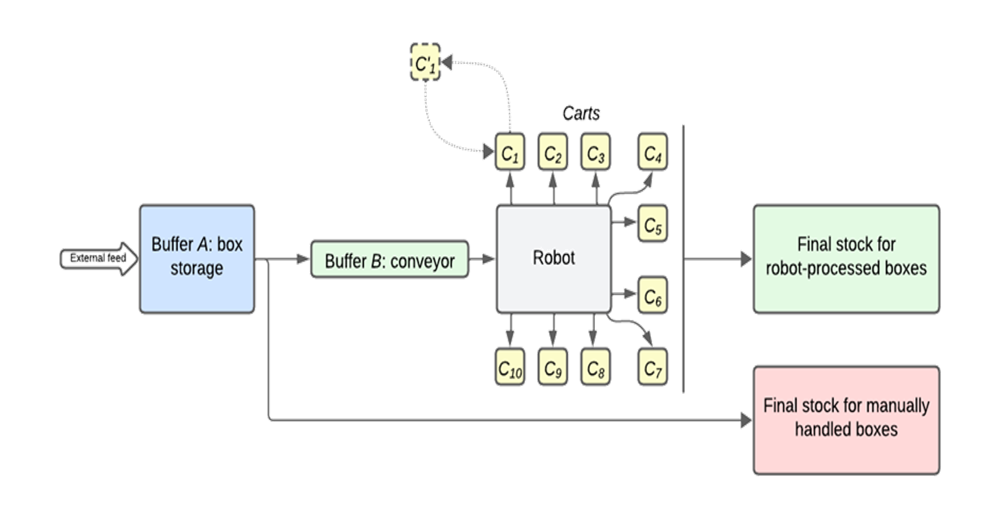

# Flexibac – Simulation Multi-Agent avec approche MBSE


**💡 Contexte :** Concours IMIC'25 : Flexibac - **🥈 2ème meilleure solution**       
**🎯 Objectif :** Proposer une solution pour intégrer un robot 6 axes à un système de tri postal  
**🛠 Technologies :** AnyLogic • Cameo Systems Modeler • Rhapsody   
**👥 Auteurs :** Jules Terlez • Abdessamad Boungab • William Derigent  
**🏫 Université de Lorraine** – Projet universitaire - Master Ingénierie des Systèmes Complexes  

---

## ✨ Aperçu rapide

- 💡 **IMIC (International Manufacturing International Contest) : [Concours annuel international](https://hal.science/EC-NANTES/hal-04770839v1)** pour créer un **Benchmark**.  
  En **2025**, le problème posé est : **[Flexibac](https://github.com/GIS-S-mart/Benchmark-9-IMIC)** --> **_Intégrer un robot 6 axes au système de tri de la Poste de Nantes_**
<details>
  <summary>En savoir plus sur le concours IMIC</summary>

  > Chaque année, un problème de production intelligente est posé à plusieurs universités participantes dans le monde.  
  > 1. Les universités participantes **proposent** chacune une **solution**.  
  > 2. Ces solutions forment ainsi un **Benchmark** pour le problème posé.  
  > 3. La **meilleure solution** est retenue comme **référence** pour ce problème.  
  > 4. Un **article scientifique** présentant cette solution est publié.
---
<p align="center">
    <br>
    <em>Schéma du système de tri pour le problème Flexibac</em>
  </p>
</details>

- 🎯 **Maximiser le nombre de cartons traités par le robot** (ce qui implique) :  
      1. Aiguiller les cartons vers le robot ou vers les opérateurs  
      2. Gérer les chariots
    
- 🛠 **Conception de la solution avec approche MBSE** (Model-Based Systems Engineering) :  
      1. Ingénierie des Exigences  
      2. Architecture Système  
      3. Modélisation du système sur Anylogic
    
- 📦 Simulation **multi-agents** disponible ici.

---

## 📷 Visuels 

<details>
  <summary>Aperçu simulation Anylogic</summary>
<p align="center">
    <br>
    <em>Aperçu simulation Anylogic</em>
  </p>
</details>


## 🚀 Lancer la simulation
1. Installer **AnyLogic (version utilisée : préciser ici)**  
2. Ouvrir le modèle :  
   ```bash
   /models/Flexibac.alp
3. Lancer ▶ et observer les résultats (statistiques affichées en fin de simulation).

---

## 📂 Organisation du dépôt

- /models → fichiers AnyLogic
- /src → code auxiliaire (agents, fonctions, scripts)
- /docs → 📄 Rapport complet (PDF)
- /assets → images & diagrammes SysML
- /results → exports de simulation

---

## 🔮 Améliorations prévues

- ✅ Optimiser la stratégie de gestion des chariots
- ✅ Tester sur plusieurs instances (au-delà de Nc_5_50_10_1)
- ✅ Réduire le nombre de boîtes perdues
- 🔄 Comparer avec d’autres approches (heuristiques, optimisation mathématique)

---

## 🙌 Remerciements

Projet réalisé dans le cadre du Concours IMIC’25 avec le soutien de :
- Université de Lorraine
- CRAN, CNRS UMR 7039
- Collaboration industrielle avec La Poste & Université de Nantes
