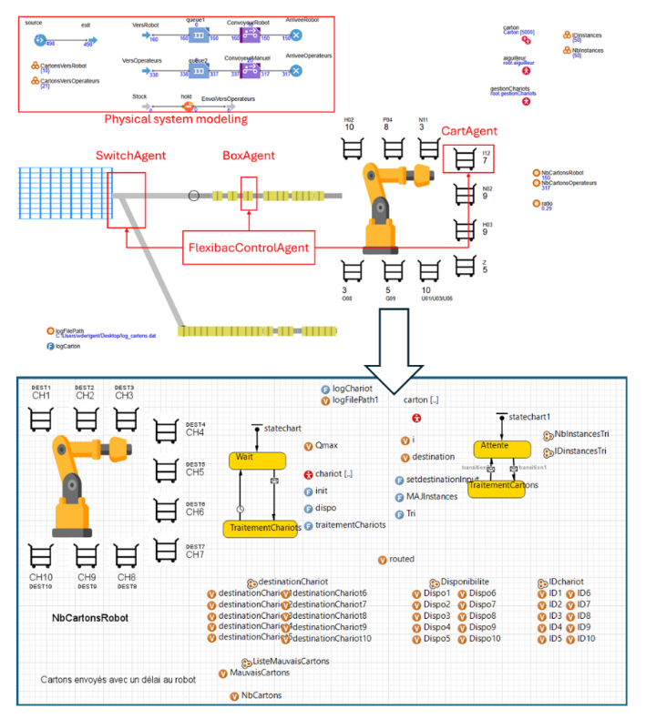

# Flexibac – Simulation Multi-Agent avec approche MBSE

**💡 Contexte :** Concours IMIC'25 : Flexibac - **🥈 2ème meilleure solution**       
**🎯 Objectif :** Proposer une solution pour intégrer un robot 6 axes à un système de tri postal  
**🛠 Technologies :** AnyLogic • Cameo Systems Modeler • Rhapsody   
**👥 Auteurs :** Jules Terlez • Abdessamad Boungab • William Derigent  
**🏫 Université de Lorraine** – Projet universitaire - Master Ingénierie des Systèmes Complexes  

---

## Aperçu rapide

- 💡 **IMIC** (International Manufacturing International Contest) est un **concours annuel international**[1](https://hal.science/EC-NANTES/hal-04770839v1) pour créer un Benchmark.  
  En **2025**, dans le cadre de ce concours, le problème posé est : **Flexibac**[2](https://github.com/GIS-S-mart/Benchmark-9-IMIC) --> **_Intégrer un robot 6 axes au système de tri de la Poste de Nantes_**

  
En savoir plus sur le concours IMIC

  > Chaque année, un problème de production intelligente est posé à plusieurs universités participantes dans le monde.  
  > 1. Les universités participantes **proposent** chacune une **solution**.  
  > 2. Ces solutions forment ainsi un **Benchmark** pour le problème posé.  
  > 3. La **meilleure solution** est retenue comme **référence** pour ce problème.  
  > 4. Un **article scientifique** présentant cette solution est publié.
---

     
    <em>Schéma du système de tri pour le problème Flexibac</em>
  

- 🎯 Objectif – **Maximiser le nombre de cartons traités par le robot** (ce qui implique) :  
      1. Aiguiller les cartons vers le robot ou vers les opérateurs  
      2. Gérer les chariots
    
- 🛠 **Conception de la solution avec approche MBSE** (Model-Based Systems Engineering) :  
      1. Ingénierie des Exigences  
      2. Architecture Système  
      3. Modélisation du système sur Anylogic
    
- 📦 <ins>Simulation **multi-agents**</ins> disponible **[ici](lien)**

---

## 👇 Document final & Résultat
- Voir [article scientifique](results/Proposed_Solution.pdf)
- **2ème meilleure solution** : <ins>prix du jury</ins>[3](assets/images/Jury_Prize_Flexibac.pdf)

---

## 📷 Visuels 

  
Aperçu simulation Anylogic

     
    <em>Aperçu simulation Anylogic</em>
  

---

## 📂 Organisation du dépôt

- `assets` → instances & images  
- `models` → fichiers AnyLogic, Cameo Systems Modeler, Rhapsody
- `results` → exports de simulation + rapport final
- `system_engineering` → 📄 Rapports complets expliqués (PDF)

---

## 🚀 Lancer la simulation

1. Téléchargez le dossier -> models/Anylogic_Modelisation/Flexibac
2. Téléchargez Anylogic (version 8.9.4 ou supérieure).
3. Lancez Anylogic.
4. Ouvrez le fichier Anylogic (Ctrl+O ou Fichier -> Ouvrir) : Flexibac.alp
5. Exécutez (F5 ou Modèle -> Exécuter).

---

## 🔗 Liens
1. Concours IMIC'25 : [https://hal.science/EC-NANTES/hal-04770839v1](https://hal.science/EC-NANTES/hal-04770839v1)  
2. Problème Flexibac : [https://github.com/GIS-S-mart/Benchmark-9-IMIC](https://github.com/GIS-S-mart/Benchmark-9-IMIC)
3. Prix du jury : [lien_vers_certificat](assets/images/Jury_Prize_Flexibac.pdf)
4. Simulation : [lien](lien)
5. Article scientifique : [results/Proposed_Solution.pdf](results/Proposed_Solution.pdf)

---

## 🙌 Remerciements

Projet réalisé dans le cadre du Concours IMIC’25 avec le soutien de :
- Université de Lorraine
- CRAN, CNRS UMR 7039
- Collaboration industrielle avec La Poste & Université de Nantes
