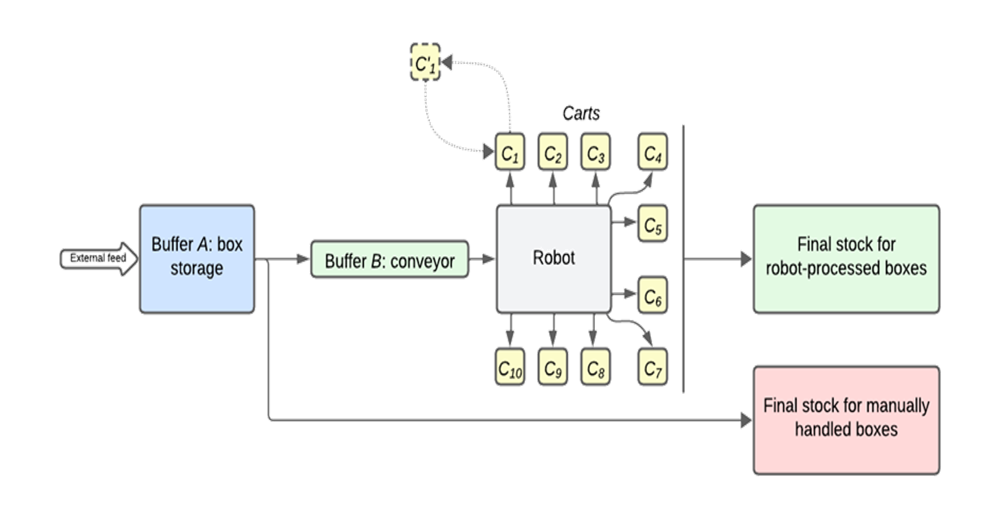
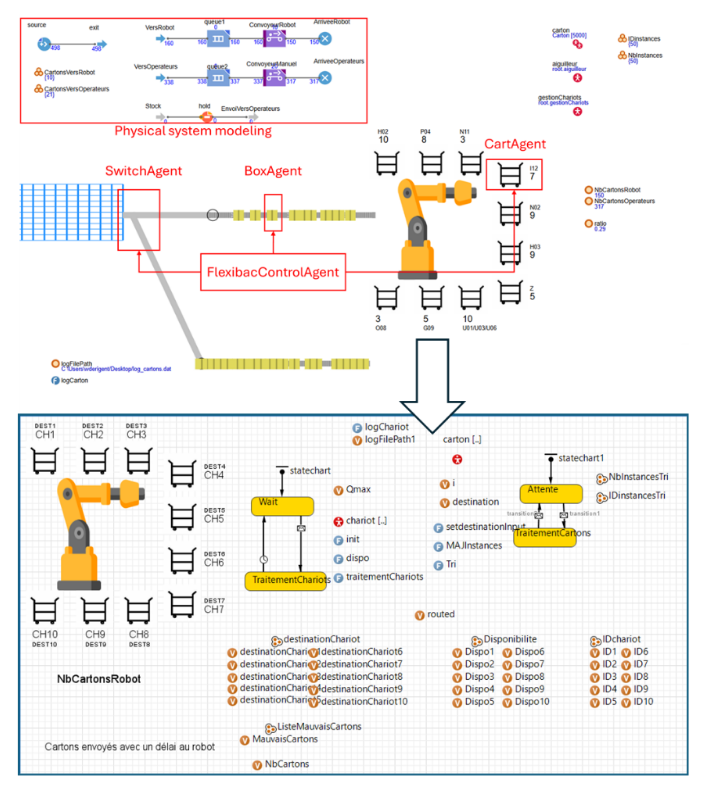
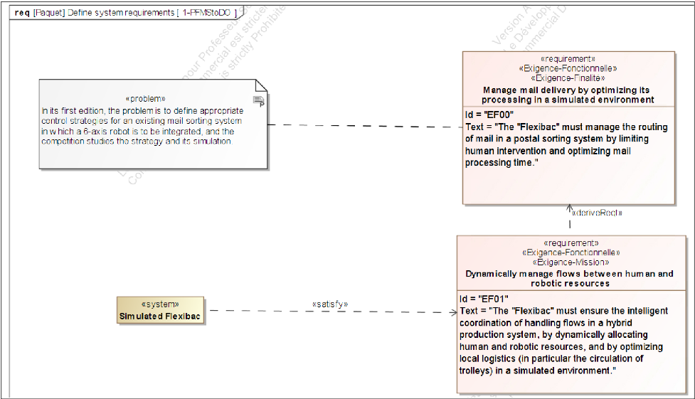
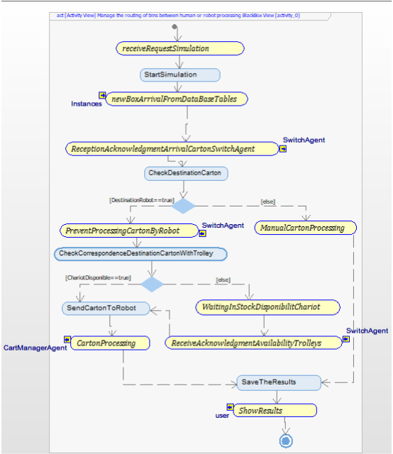

🌐 Available languages: [English](README.md) | [Français](README.fr.md)

# Flexibac – Multi-Agent Simulation with MBSE Approach

**💡 Context:** IMIC'25 Competition: Flexibac – **🥈 2nd Best Solution**  
**🎯 Objective:** Propose a solution to integrate a 6-axis robot into a postal sorting system  
**🛠 Technologies:** AnyLogic • Cameo Systems Modeler • Rhapsody  
**👥 Authors:** Jules Terlez • Abdessamad Boungab • William Derigent  
**🏫 Université de Lorraine** – Academic Project – Master’s in Complex Systems Engineering  

---

## Quick Overview

💡 **IMIC** (International Manufacturing International Contest) is an **annual international competition**[1](https://hal.science/EC-NANTES/hal-04770839v1) aimed at creating a benchmark.  
  In **2025**, the proposed challenge was: **Flexibac**[2](https://github.com/GIS-S-mart/Benchmark-9-IMIC) --> **_Integrating a 6-axis robot into the Nantes postal sorting system_**

  
More about the IMIC competition

  > Each year, a smart manufacturing problem is presented to participating universities worldwide.  
  > 1. Each university **proposes** a **solution**.  
  > 2. These solutions form a **benchmark** for the given problem.  
  > 3. The **best solution** is selected as the **reference**.  
  > 4. A **scientific paper** describing this solution is published.
  ---
  

     
    <em>Sorting system schematic – Flexibac problem</em>
  

🎯 Goal – **Maximize the number of boxes processed by the robot**, which involves:  
  1. Routing parcels to the robot or to human operators  
  2. Managing trolleys

🛠 **Solution designed using an MBSE approach** (Model-Based Systems Engineering):  
  1. Requirements Engineering  
  2. System Architecture  
  3. System Modeling in AnyLogic

📦 <strong><ins>Multi-agent simulation</ins></strong> available **[here](link)**

---

## 👇 Final Report & Result

- See [scientific paper](results/Proposed_Solution.pdf)  
- **2nd Best Solution**: <ins>Jury Award</ins>[3](assets/images/Jury_Prize_Flexibac.pdf)

---

## 📷 Visuals

  
AnyLogic Simulation Preview

  

     
    <em>AnyLogic simulation preview</em>
  

---

## 📂 Repository Structure

- `assets` → instances & images   
- `models` → AnyLogic, Cameo Systems Modeler, and Rhapsody files  
- `results` → simulation exports + final report
- `system_engineering` → 📄 Full explained reports (PDF)
  
---

## 📒 Documentation

The entire design can be found in -> `system_engineering/“select a language”`   
You can find the system engineering consisting of :  
1. The system architecture explanation
2. The requirements engineering explanation

  
System engineering preview

  

     
    <em>Requirement Engineering Preview : PFMS</em>
                   
     
    <em>Architecture System Preview : Routings bins (robot/humans)</em>
  

---

## 🚀 Running the Simulation

1. Download the folder: `models/Anylogic_Modelisation/Flexibac`  
2. Install AnyLogic (version 8.9.4 or higher)  
3. Launch AnyLogic  
4. Open the AnyLogic file (`Ctrl+O` or File → Open): `Flexibac.alp`  
5. Run the simulation (`F5` or Model → Run)

---

## 🔗 Links

1. IMIC'25 Competition: [https://hal.science/EC-NANTES/hal-04770839v1](https://hal.science/EC-NANTES/hal-04770839v1)  
2. Flexibac Problem: [https://github.com/GIS-S-mart/Benchmark-9-IMIC](https://github.com/GIS-S-mart/Benchmark-9-IMIC)  
3. Jury Award: [link_to_certificate](assets/images/Jury_Prize_Flexibac.pdf)  
4. Simulation: [link](link)  
5. Scientific Paper: [results/Proposed_Solution.pdf](results/Proposed_Solution.pdf)

---

## 🙌 Acknowledgments

This project was developed as part of the IMIC’25 Competition with the support of:

- Université de Lorraine  
- CRAN, CNRS UMR 7039  
- Industrial collaboration with La Poste & Université de Nantes

